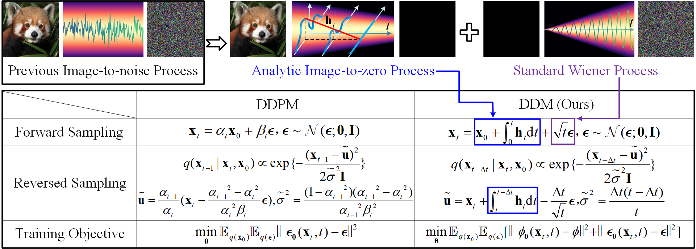

# DDM
## Decoupled Diffusion Models: Image to Zero and Zero to Noise


## Framework


## I. Before Starting.
1. install torch
~~~
pip install torch==1.12.1+cu113 torchvision==0.13.1+cu113 torchaudio==0.12.1 --extra-index-url https://download.pytorch.org/whl/cu113
~~~
2. install other packages.
~~~
pip install -r requirement.txt
~~~
3. prepare accelerate config.
~~~
accelerate config
~~~

## II. Prepare Data.
The file structure should look like:
```commandline
data_root
|-- images
|   |-- XXX.jpg
|   |-- XXX.jpg
|-- condition_images
|   |-- XXX.jpg
|   |-- XXX.jpg
```

## III. Unconditional training on image space for Cifar10 dataset.
~~~
accelerate launch train_uncond_dpm.py --cfg ./configs/cifar10/XXX.yaml
~~~

## IV. Unconditional training on latent space for CelebAHQ256 dataset.
1. training auto-encoder:
~~~
accelerate launch train_vae.py --cfg ./configs/celebahq/celeb_ae_kl_256x256_d4.yaml
~~~
2. you should add the model weights in the first step to config file `./configs/celebahq/XXX.yaml`, then train latent diffusion model:
~~~
accelerate launch train_uncond_ldm.py --cfg ./configs/celebahq/XXX.yaml
~~~

## V. Conditional training on latent space for DIV2K dataset. (super-resolution task for example.)
1. training auto-encoder:
~~~
accelerate launch train_vae.py --cfg ./configs/super-resolution/div2k_ae_kl_512x512_d4.yaml
~~~
2. training latent diffusion model:
~~~
accelerate launch train_cond_ldm.py --cfg ./configs/super-resolution/div2k_cond_ddm_const_ldm.yaml
~~~

## VI. Conditional training on image space. (saliency detection task for example.)
~~~
accelerate launch train_cond_dpm.py --cfg ./configs/saliency/DUTS_ddm_const_dpm_114.yaml
~~~

## VII. Faster Sampling
**change the sampling steps "sampling_timesteps" in the config file**
1. unconditional generation:
~~~
python sample_uncond.py --cfg ./configs/cifar10/ddm_uncond_const_uncond_unet.yaml
python sample_uncond.py --cfg ./configs/celebahq/celeb_uncond_ddm_const_uncond_unet_ldm.yaml
~~~
2. conditional generation (Latent space model):
- Super-resolution:
~~~
python ./eval_downstream/eval_sr.py --cfg ./configs/super-resolution/div2k_sample.yaml
~~~
- Inpainting:
~~~
python ./eval_downstream/sample_inpainting.py --cfg ./configs/celebahq/celeb_uncond_ddm_const_uncond_unet_ldm_sample.yaml
~~~
- Saliency:
~~~
python ./eval_downstream/eval_saliency.py --cfg ./configs/saliency/DUTS_sample_114.yaml
~~~